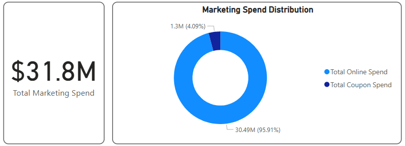
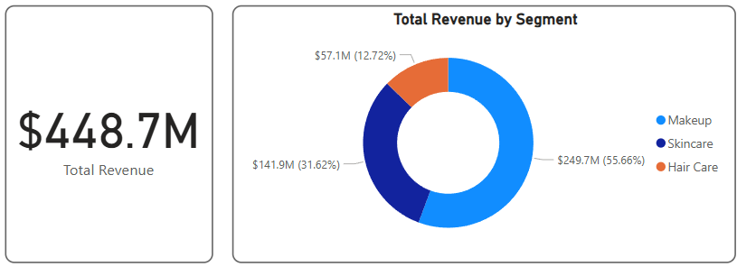
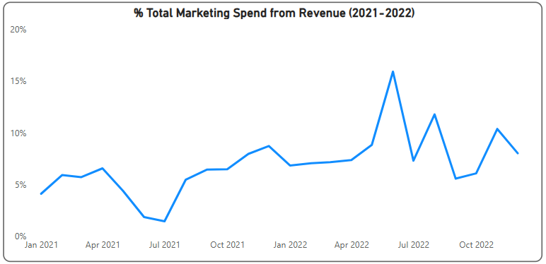

# 📦 Synergix Solutions Ecom Analysis

Synergix Solutions is a multinational consumer goods e-commerce company that sells a wide range of consumer products. With a strong presence in the market, the company continually strives to enhance its market share, drive revenue growth, and strengthen its brand equity. The Company's e-commerce portal was launched two years ago, and it has been successful in attracting customers from various parts of the world.

However, in the recent past, the sales have not been increasing as predicted, and the management is concerned about the future of the business. They have tried various strategies such as discounts, promotions, and ads but these have not yielded desired results. The management believes that there may be underlying issues that need to be addressed to improve sales performance.

## 🧾 Dataset Overview

The dataset provided by Synergix Solutions includes the following key components:

- **POS Data**: Sales transaction details such as SKU ID, revenue, quantity sold, price per unit, and product attributes like brand, category, and manufacturer.

- **Online**: Online advertising metrics including impressions, clicks, cost, and campaign information linked to each SKU.

- **Offline**: Traditional media performance data for video and image campaigns, covering impressions, clicks, and costs by brand.

- **Product Attributes**: Granular product-level metadata including star ratings, content availability (videos, images, descriptions), and product availability status.

- **Vendor-Powered Coupons (VPC)**: Data on promotional campaigns funded by vendors — including units sold using coupons and promotional spend.

- **Search Rank**: Organic search visibility data showing how often products are searched and their median search ranking.

👉 [View Full Data Dictionary](./Data/Data_Dictionary.png)


## 📌 Problem Statements, Solution approach and Key Findings

**❓ Synergix Has Been Aggressively Channeling Their Resources Into Online Marketing to attract more users to their e-commerce portal. Now, after a period of rigorous marketing, one crucial question looms large at Synergix:**

**"_Was The Online Marketing Investment Worth It?_"**

🔍 To answer this, we begin by visualizing **Total Online Spend** and **Total Revenue** over time using the **Date** column from the [Calendar Table](#-table-relation-model-and-creating-calendar-table). We remove the **Day** level from the hierarchy to get a **monthly view across two years**.

💡 As you can see It's evident that as **online marketing spend** increases, there’s a **parallel rise in monthly revenue** over time.


To understand **what’s driving this revenue growth**, we break down its two components:  
- **Units Sold**
- **Price Per Unit**

Next, we visualize **Average Unit Price** (from POS Data) against Dates from the [Calendar Table](#-table-relation-model-and-creating-calendar-table), again removing the Day level to view monthly trends.

💡 This clearly shows that **Synergix has steadily increased unit prices over time**, which is **likely the primary driver** behind the rising revenue.


To verify whether **units sold** also contributed to revenue growth, we compare **Total Units Sold** and **Total Online Spend** over time using a **Line and Clustered Column Chart**.

💡 The result shows that while **online marketing expenses nearly doubled** over two years, there has been **no significant increase in units sold**. This confirms that **the revenue growth is primarily due to the increased unit price**.


💡 However, here’s an **interesting insight**: Despite the **higher unit price**, **product demand has not declined**. This may suggest that the **increased online marketing spend helped sustain demand**.

⚠️ Still, from a **business sustainability** perspective, relying **solely on higher pricing** — without growing the **customer base or sales volume** — is a **risky and short-sighted strategy**.

---

**❓ Synergix is looking to understand how web traffic is influencing product sales. As part of their digital growth objectives, they’ve set a target to increase web traffic by 10%. The team now wants to analyze the relationship between traffic volume and units sold, and evaluate whether they are on track to meet this goal.**.

🔍 To tackle with this question, we have to plot **Total Web Traffic** and **Total Units Sold** over time using a **Line and Clustered Column Chart**.  
Make sure to **remove the Quarter and Day levels** from the Date hierarchy for a cleaner, monthly view.

💡 The analysis reveals a **moderately positive relationship** between **Web Traffic** and **Units Sold**.  
We can clearly observe that **spikes in web traffic correlate with increases in unit sales**.


For tracking the **traffic target**, we create a **KPI card**. But before that, we define two DAX measures:  
- **Web Traffic Latest Month**  
- **Web Traffic Target**

You can find the DAX logic for these measures in the [🛠️ DAX](#dax) section.


---

**❓ The marketing team at Synergix wants to evaluate the performance of their online advertising campaigns. Specifically, they are interested in tracking the Click-Through Rate (CTR) over time and assessing whether they are progressing toward a new strategic goal of increasing CTR by 5%.**.

🔍 To begin, we first need to create the following DAX measures:  
- **Total Online Clicks**  
- **Total Online Impressions**

Then, using these two, we calculate the **Online CTR** measure.

Next, we create an **Area Chart** with **Online CTR** on the Y-axis and **Dates** from the [Calendar Table](#-table-relation-model-and-creating-calendar-table) on the X-axis.

💡 The chart reveals some **concerning insights** — even at their **peak performance in September 2022**, Synergix only achieved a **CTR of 0.74%**, which is **way below industry averages** which is about 1%-2%.

From earlier analysis, we already know that **marketing spend has been increasing**, yet this visualization confirms that **Online CTR hasn’t significantly improved** over time.

📈 Another notable observation:  
There are **certain months where CTR spikes**, indicating the online ads were **particularly compelling**.  
However, **other months show dips**, suggesting inconsistency in ad effectiveness.  
This highlights the need for the **marketing team to actively monitor CTR performance** and establish a **target benchmark**.


To track the **CTR target**, we create a **KPI card** using two more DAX measures:  
- **CTR Latest Month**  
- **CTR Target**

You can find the DAX logic for these measures in the [🛠️ DAX](#dax) section.


---

**❓  As part of its cost optimization strategy, Synergix has set a goal to reduce its Cost Per Click (CPC) for online advertising by 2%. The marketing team wants to monitor CPC trends over time and evaluate whether this cost-efficiency target is being achieved.**

🔍 To proceed with this analysis, we first need to create a measure, **Online CPC** (Cost Per Click).  
Next, we plot an **Area Chart** using **Online CPC** over time, removing the **Day level** from the Dates hierarchy in the [**Calendar Table**](#-table-relation-model-and-creating-calendar-table).

💡 The visualization reveals that **CPC values fluctuate month-to-month** — with certain months showing **spikes**, while others show **dips**.  
- A **high CPC** indicates that Synergix paid more per click, possibly due to **increased competition** or **lower ad relevance**, making **customer acquisition more expensive**.  
- A **low CPC** means the company achieved **more efficient ad spending**, gaining more value for the same cost.

📉 Despite these fluctuations, there is **no clear long-term upward or downward trend** in CPC.


To gain deeper insight, we overlay the **Online CTR** measure on the **secondary Y-axis** of the same chart.

💡 This reveals an **inconsistent relationship** between **CPC and CTR**.  
However, a **noteworthy observation** is that in **January and February 2022**, **CTR peaked while CPC dropped** — indicating **high-performing, cost-effective ad campaigns**.

📌 This insight can help the marketing team **reverse-engineer successful strategies** from those months and apply them to future campaigns.


To evaluate whether Synergix is moving toward its **2% CPC reduction target**, we create a **KPI card** using these DAX measures:
- **CPC Latest Month**
- **CPC Target**

You can find the logic for these measures in the [**🛠️ DAX**](#dax) section.

📊 Since **lower CPC is favorable**, be sure to configure the KPI card appropriately:  
- Under **Visual Format > Trend Axis**, set **Direction = Low is Good**  
- Set **Distance Direction = Increasing is Positive** to accurately reflect performance.


---

❓ **The finance team at Synergix wants to analyze the overall marketing investment and how it compares with the Revenue.
They’re particularly interested in:**

- **Tracking the total marketing spend.**
- **Breaking down channel-wise contribution (Online Ads vs VPC) within the total marketing spend.**

🔍 At Synergix, **online marketing expenses** are divided into two key components:
- **Online Ad Spend**
- **Voucher & Coupon (VPC) Spend**

To analyze the **total marketing investment**, we first calculate:
- **Total Online Spend** (already calculated)
- **Total Coupon Spend**
➡️ Adding these gives us the **Total Marketing Spend.**

You can find the DAX logic for all three measures in the [**🛠️ DAX**](#-dax) section.

Using a **Donut Chart**, we visualize the **distribution** of marketing spend across the two channels.

💡 From **January 2021 to December 2022**, Synergix invested **$31.8 million** in online marketing.
The visual clearly highlights a **heavy bias toward Online Ads**, which account for **96% of the total marketing budget.**



---

❓ **Synergix management wants to evaluate their overall revenue and understand how it is distributed across different segments.**\
**Lastly for long-term sustainable growth, Synergix implemented a strategic policy to allocate 20% of total revenue to online marketing initiatives. So they decided to analyze whether this 20% reinvestment threshold has been consistently met on a monthly basis over the past two years.**

🔍 We’ve already calculated **Total Revenue**, and now we’ll dive deeper by creating a **Donut Chart** to visualize **revenue distribution across different segments**.

💡 The **Total Revenue** generated from **January 2021 to December 2022** stands at an impressive **$448.7 million**, with the **Makeup segment** emerging as the **top contributor** to Synergix’s earnings.



To address the **second part** of this analysis, we create a new measure:
> **% Total Marketing Spend from Revenue** = Total Marketing Spend / Total Revenue

This allows us to **track the efficiency** of marketing investments in proportion to the revenue generated over time.

💡 In **2021**, marketing spend as a percentage of revenue consistently stayed within the **6–8%** range.  
However, in the **second half of 2022**, several months crossed the **10%** threshold — indicating Synergix is moving toward its **20% reinvestment goal** and has **room to scale** online marketing initiatives.




## 🛠️ DAX
Some key DAX formulas logic used to create measures for this project:

- **Total Online Spend**
```
Total Online Spend = SUM('Online data'[Online_Cost])
```

- **Total Revenue**
```
Total Revenue = SUM('POS data'[Revenue($)])
```

- **Total Units Sold**
```
Total Units Sold = SUM('POS data'[Units_sold])
```

- **Total Web Traffic**
```
Total Web Traffic = SUM('POS data'[Page_traffic])
```

- **Web Traffic Latest Month**
```
Web Traffic Latest Month = 
CALCULATE(
    [Total Web Traffic], DATESMTD('Calendar Table'[Date])
)
```

- **Web Traffic Target**
```
Web Traffic Target = 
CALCULATE(
    [Total Web Traffic],
    PREVIOUSMONTH('Calendar Table'[Date])
) * 1.10
```

- **Total Online Clicks**
```
Total Online Clicks = SUM('Online data'[Online_Clicks])
```

- **Total Online Impressions**
```
Total Online Impressions = SUM('Online data'[Online_Impressions])
```

- **Online CTR**
```
Online CTR = 
DIVIDE( 
    [Total Online Clicks],
    [Total Online Impressions],
    0
)
```

- **CTR Latest Month**
```
CTR Latest Month = 
CALCULATE(
    [Online CTR],
    DATESMTD('Calendar Table'[Date])
)
```
- **CTR Target**
```
CTR Target = 
CALCULATE(
    [Online CTR],
    PREVIOUSMONTH('Calendar Table'[Date])
) * 1.05
```

- **Online CPC**
```
Online CPC = 
DIVIDE(
    [Total Online Spend],
    [Total Online Clicks],
    0
)
```

- **CPC Latest Month**
```
CPC Latest Month = 
CALCULATE(
    [Online CPC],
    DATESMTD('Calendar Table'[Date])
)
```

- **CPC Target**
```
CPC Target = 
CALCULATE(
    [Online CPC],
    PREVIOUSMONTH('Calendar Table'[Date])
) * 0.98
```

- **Total Coupon Spend**
```
Total Coupon Spend = SUM('VPC data'[Sum of Spend])
```

- **Total Marketing Spend**
```
Total Marketing Spend = [Total Online Spend] + [Total Coupon Spend]
```

- **% Total Marketing Spend from Revenue**
```
% Total Marketing Spend from Revenue = 
DIVIDE(
    [Total Marketing Spend],
    [Total Revenue],
    0
)
```


## 🔗 Table Relation Model and Creating Calendar Table

Before proceeding with any steps in this project, it is **mandatory to create a Calendar Table** in Power BI. This table acts as a central reference for all time-based analysis and relationships across the data model.

Since multiple tables in this dataset contain date fields (e.g., POS data, media campaigns, product activity), a dedicated Calendar Table ensures:
- Consistent and accurate date filtering
- Enables Time Intelligence functions
- Simplifies relationships across fact tables

👉 **Use the following DAX formula in Power BI to create the Calendar Table:**

```
Calendar Table =
VAR StartYear = 2021
VAR EndYear = 2022
RETURN
    ADDCOLUMNS (
        CALENDAR ( DATE ( StartYear, 1, 1 ), DATE ( EndYear, 12, 31 ) ),
        "Year", YEAR ( [Date] ),
        "Month No.", MONTH ( [Date] ),
        "Day", DAY ( [Date] ),
        "Day Name", FORMAT ( [Date], "DDDD" ),
        "Day Name Short", FORMAT ( [Date], "DDD" ),
        "Month Name", FORMAT ( [Date], "MMMM" ),
        "Month Name Short", FORMAT ( [Date], "MMM" ),
        "Quarter", QUARTER ( [Date] ),
        "Quarter Name", "Q" & FORMAT ( [Date], "Q" ),
        "Week of Year", WEEKNUM ( [Date] )
    )
```
After creating the Calendar Table, you must establish relationships between the Calendar Table and every other table that contains a Date column.
Once all relationships are built correctly, your model should look similar to [this](./Assets/Table_Relation_Model.png).

## 🧠 Tools Used
- **Power BI** for data modeling, visualization, and interactivity

- **DAX** for custom calculations

- **Excel** for initial dataset understanding & eyeballing.

_I designed this data and dashboard to simulate a real-world business scenario and solve practical problems using data. I aimed to balance performance metrics, storytelling, and visual clarity._

_Feel free to explore, give feedbacks, or suggest improvements!_